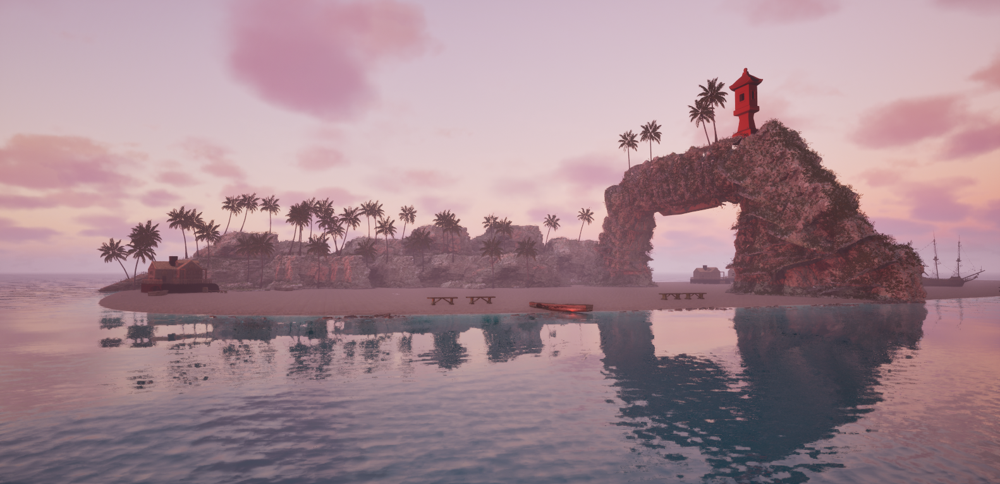
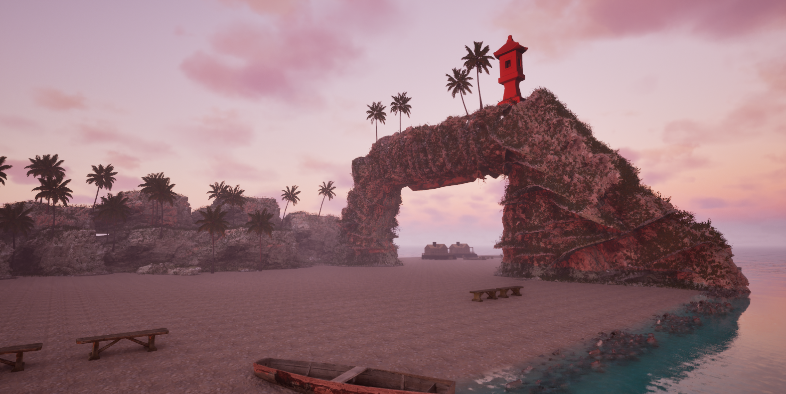

# Tropical Beach Environment | Unreal Engine 5

## 🌴 Overview

Tropical Beach Environment is a realistic 3D environment project created using Unreal Engine 5.

The project focuses on designing an immersive tropical beach scene using Unreal Engine tools including landscape creation, water systems, dynamic lighting, and realistic assets.

---

## 🎮 Features

- Realistic tropical beach environment
- Custom landscape design
- Water system implementation
- Dynamic lighting using Lumen
- Blueprint scripting
- High-quality environment assets

---

## 🛠 Technologies Used

- Unreal Engine 5
- Blueprint Scripting
- Landscape System
- Water System
- Lumen Global Illumination
- Quixel Megascans
- Fab Asset Library

---

## 🚀 Development Process

### Environment Design

Created a detailed tropical beach environment using Unreal Engine Landscape tools.

Implemented:

- Terrain
- Beach area
- Natural environment elements

### Lighting System

Used Lumen for:

- Real-time global illumination
- Realistic shadows
- Natural atmosphere

### Water System

Implemented Unreal Engine water tools to create realistic ocean and beach environments.

### Asset Integration

Integrated realistic environment assets from:

- Quixel Megascans
- Fab Asset Library

### Blueprint Implementation

Used Blueprint scripting for environment logic and Unreal Engine workflows.

---

## 📸 Screenshots

### Tropical Beach Overview

### Landscape Design

### Water & Lighting System

---

## 🎥 Demo Video

(Add video link here)

---

## 📚 Skills Demonstrated

- Unreal Engine 5 workflow
- 3D environment design
- Level design
- Blueprint visual scripting
- Real-time rendering
- Asset management

## 👨‍💻 Author

Vedant Shinde
